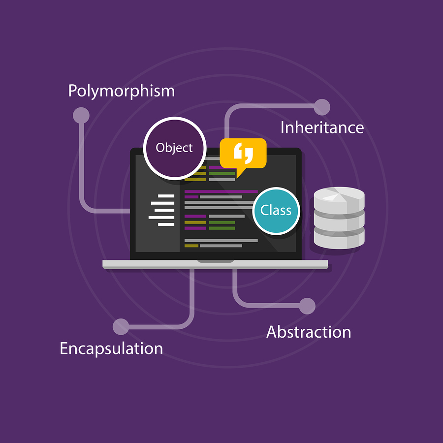

# Programação Python
> Artigos sobre a linguagem e documentação de projetos em python  

 
 

## Python POO
[Uma coletânea de artigos que abordam a estrutura e a aplicação da Programação Orientada a Objetos usando Python. Inclui boas práticas, padrões de projeto e exemplos passo a passo.](POO/POO.md)

